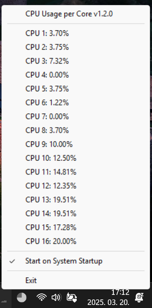
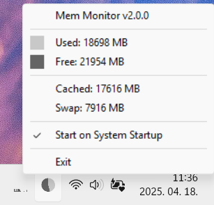

# CPU and Memory Monitor

This repository contains two system tray applications written in C:
- **CPU Monitor**: Displays CPU usage per core and updates a bar chart icon in the system tray.


  CPU monitor systray icon with CPU usage:

  


  CPU monitor systray icon with menu:

 

- **Memory Monitor**: Displays memory usage statistics and updates a pie chart icon in the system tray.


  Mem monitor systray icon with Mem usage:

  

  Mem monitor systray icon with details menu:

  


## Build Windows

To build and run the applications on macOS:

```sh
# Build CPU Monitor
\mingw32\bin\gcc -ffunction-sections -fdata-sections -s -o cpu-monitor cpu-monitor.c cpu-monitor_res.o -lpdh -mwindows -lwinmm -Wl,--gc-sections -static-libgcc

# Build Memory Monitor
\mingw32\bin\gcc -ffunction-sections -fdata-sections -s -o mem-monitor mem-monitor.c mem-monitor_res.o -lpdh -mwindows -lwinmm -Wl,--gc-sections -static-libgcc
```

## Features
- Displays live CPU core usage in the system tray.
- Displays memory usage statistics in the system tray.
- Updates system tray icons dynamically to reflect real-time usage.
- Provides an exit option to close the application.

## License
This project is open-source and available under the MIT License.

